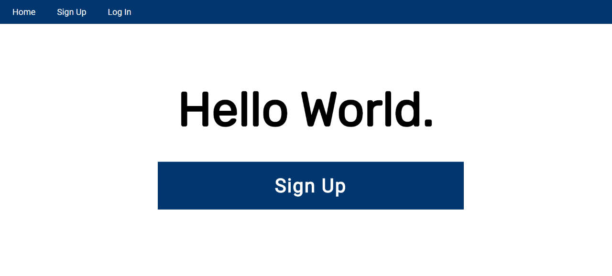

# ccapdev-session
Express-Session Tutorial for CCAPDEV1920T2

This repository will help you integrate sessions to your web applications using [express-session](http://expressjs.com/en/resources/middleware/session.html). This web application is based on the previous [repository on hashing tutorial](https://github.com/arvention/ccapdev-hashing). For this tutorial, we will use [express-session](http://expressjs.com/en/resources/middleware/session.html) to store information about the logged-in user.

## Contents:

Each folder and file in this repository is properly documented. You may read the `README.md` file of each folder to understand its content. You may also read the inline comments of each file explaining the statements line-per-line.

- [controllers](controllers) - This folder contains files which defines callback functions for client requests.
- [helpers](helpers) - This folder contains files which contains helper functions.
- [models](models) - This folder contains files for database modeling and access.
- [public](public) - This folder contains static assets such as css, js, and image files.
- [routes](routes) - This folder contains files which describes the response of the server for each HTTP method request to a specific path in the server.
- [views](views) - This folder contains all hbs files to be rendered when requested from the server.
- [index.js](index.js) - The main entry point of the web application.


## Follow the steps below to set-up and study this repository:
1. Clone the repository either by downloading the contents of the repository [here](https://github.com/arvention/ccapdev-session/archive/master.zip), or using the command below (Note: git should be installed in your system for this to work).
```
git clone https://github.com/arvention/ccapdev-session
```
2. Open Command Prompt
3. Navigate to the project folder - the folder containing the contents of the cloned or downloaded repository.
4. Run the command `npm install` to initialize and install all necessary modules used in the project.

5. We may now run our server. To do this, we run the command `node index.js`. Upon running the command, your Command Prompt should display the following statement:
```
app listening at port 9090
Connected to: mongodb://localhost:27017/ccapdev-session
```

6. Let's test our web application. Go to the link below to access the web application:
```
http://localhost:9090/
```

Your web browser should display the screen below:

