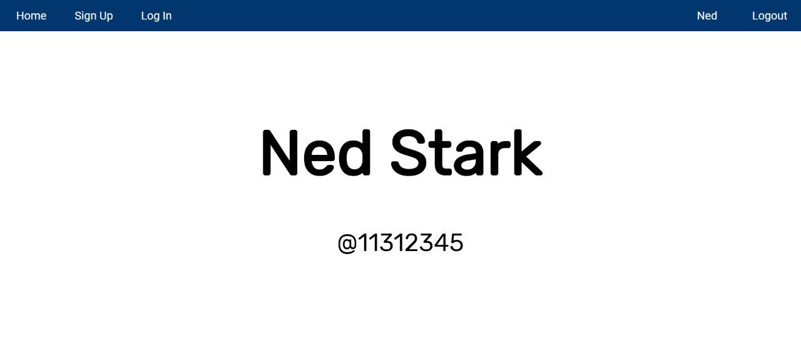
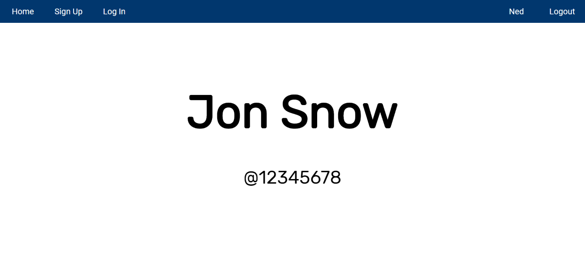

# ccapdev-session
Express-Session Tutorial for CCAPDEV1920T2

This repository will help you integrate sessions to your web applications using [express-session](http://expressjs.com/en/resources/middleware/session.html). This web application is based on the previous [repository on hashing tutorial](https://github.com/arvention/ccapdev-hashing). For this tutorial, we will use [express-session](http://expressjs.com/en/resources/middleware/session.html) to store information about the logged-in user.

## Contents:

Each folder and file in this repository is properly documented. You may read the `README.md` file of each folder to understand its content. You may also read the inline comments of each file explaining the statements line-per-line.

- [controllers](controllers) - This folder contains files which defines callback functions for client requests.
- [helpers](helpers) - This folder contains files which contains helper functions.
- [models](models) - This folder contains files for database modeling and access.
- [public](public) - This folder contains static assets such as css, js, and image files.
- [routes](routes) - This folder contains files which describes the response of the server for each HTTP method request to a specific path in the server.
- [views](views) - This folder contains all hbs files to be rendered when requested from the server.
- [index.js](index.js) - The main entry point of the web application.


## Follow the steps below to set-up and study this repository:
1. Clone the repository either by downloading the contents of the repository [here](https://github.com/arvention/ccapdev-session/archive/master.zip), or using the command below (Note: git should be installed in your system for this to work).
```
git clone https://github.com/arvention/ccapdev-session
```
2. Open Command Prompt
3. Navigate to the project folder - the folder containing the contents of the cloned or downloaded repository.
4. Run the command `npm install` to initialize and install all necessary modules used in the project.

5. We may now run our server. To do this, we run the command `node index.js`. Upon running the command, your Command Prompt should display the following statement:
```
app listening at port 9090
Connected to: mongodb://localhost:27017/ccapdev-session
```

6. Let's test our web application. Go to the link below to access the web application:
```
http://localhost:9090/
```

Your web browser should display the screen below:


7. Go to the sign-up page either using the menu item or the button. Register at least two users in the website. For reference, we will register these two users in this demonstration:
```
First Name:     Ned
Last Name:      Stark
ID Number:      11312345
Password:       password

First Name:     Jon
Last Name:      Snow
ID Number:      12345678
Password:       password
```

8. Now, go to the log-in page and try logging-in to the account of Ned Stark by entering his credentials. Upon logging-in, you will be redirected to your profile page. Additionally, notice that two tabs are added to the navigation bar - the profile tab (displaying the name of the logged-in user) and the log-out tab.

Your web browser should display the screen below:


The profile tab and the log-out tab will only appear if a user is logged-in in the web application.

Try clicking the Home and Log In tabs. Since you are already logged-in, you do not need to go to these web pages. Upon trying to go to these web pages, the web application will instead redirect you back to your profile page. While logged-in, you may still access the Sign Up tab to register a different user. Notice that the profile tab and log-out tab are displayed as long as you are logged-in in the web application.

Try going to the profile page of the other user - Jon Snow - by changing the ID in the URL to his ID Number `12345678`. The whole URL is `http://localhost:9090/profile/12345678`. Notice that it will display the details of Jon Snow, such as his full name and ID number, but the name in the profile tab still displays the name of the currently logged-in user - Ned Stark. Clicking the profile tab will also redirect the user back to Ned Stark's profile.

Your web browser should display the screen below:


To do this, we have to check the callback functions of all the paths in our server.

The code below defines the callback function for the path `/login`, as defined in [`routes/routes.js`](routes/routes.js).

```
app.post('/login', controller.postLogIn);
```

The function `postLogIn()` is the callback function executed if the client sends an HTTP POST request for the path `/login`. Shown below is the code as excerpted from [`controllers/loginController.js`](controllers/loginController.js):

```
postLogIn: function (req, res) {

    var idNum = req.body.idNum;
    var pw = req.body.pw;

    db.findOne(User, {idNum: idNum}, '', function (result) {

        if(result) {

            var user = {
                fName: result.fName,
                lName: result.lName,
                idNum: result.idNum
            };

            bcrypt.compare(pw, result.pw, function(err, equal) {

                if(equal) {

                    req.session.idNum = user.idNum;
                    req.session.name = user.fName;

                    res.redirect('/profile/' + user.idNum);
                }

                else {

                    var details = {
                        flag: false,
                        error: `ID Number and/or Password is incorrect.`
                    };

                    res.render('login', details);
                }
            });
        }

        else {

            var details = {
                flag: false,
                error: `ID Number and/or Password is incorrect.`
            };

            res.render('login', details);
        }
    });
}
```

The function `postLogIn()` checks if the user exists and the password entered by the user matches the password in the database. If the user has entered the correct user credentials, the web application stores the ID number and the first name of the user to `req.session` - the session object. Since HTTP is stateless, session is a way for us to store some 'state' or information in between HTTP requests to the server. This is usually used to store information about the logged-in user. In this web application, we store the ID number to `req.session.idNum` and the first name of the user to `req.session.name`. Using these values, we can check if there is a logged-in user for a specific client.

The code below defines the callback function for the path `/login`, as defined in [`routes/routes.js`](routes/routes.js).

```
app.get('/login', loginController.getLogIn);
```

The function `getLogIn()` is the callback function executed if the client sends an HTTP GET request for the path `/login`. Shown below is the code as excerpted from [`controllers/loginController.js`](controllers/loginController.js):

```
getLogIn: function (req, res) {

    if(req.session.idNum) {

        res.redirect('/profile/' + req.session.idNum);
    }

    else {

        var details = {
            flag: false
        };

        res.render('login', details);
    }
}
```

The function `getLogIn()` checks if the user is logged-in by checking if we have stored the ID number to `req.session` object. If the user is logged in, the client will be redirected to his profile, otherwise, it will display [`views/login.hbs`](views/login.hbs). Setting `details.flag` to false indicates that we will not display the profile tab and log-out tab in the navigation bar.

The code below defines the callback function for the path `/`, as defined in [`routes/routes.js`](routes/routes.js).

```
app.get('/', controller.getIndex);
```

The function `getIndex()` is the callback function executed if the client sends an HTTP GET request for the path `/`. Shown below is the code as excerpted from [`controllers/controller.js`](controllers/controller.js):

```
getIndex: function (req, res) {

    if(req.session.idNum) {
        res.redirect('/profile/' + req.session.idNum);
    }

    else {
        var details = {
            flag: false
        };
        res.render('index', details);
    }
}
```

The function `getIndex()` checks if the user is logged-in by checking if we have stored the ID number to `req.session` object. If the user is logged in, the client will be redirected to his profile, otherwise, it will display [`views/index.hbs`](views/index.hbs). Setting `details.flag` to false indicates that we will not display the profile tab and log-out tab in the navigation bar.

The code below defines the callback function for the path `/signup`, as defined in [`routes/routes.js`](routes/routes.js).

```
app.get('/signup', signupController.getSignUp);
```

The function `getSignUp()` is the callback function executed if the client sends an HTTP GET request for the path `/signup`. Shown below is the code as excerpted from [`controllers/signupController.js`](controllers/signupController.js):

```
getSignUp: function (req, res) {
    var details = {};

    if(req.session.idNum) {
        details.flag = true;
        details.name = req.session.name;
        details.uidNum = req.session.idNum;
    }

    else
        details.flag = false;

    res.render('signup', details);
}
```

The function `getSignUp()` checks if the user is logged-in by checking if we have stored the ID number to `req.session` object. If the user is logged in, the web application sets `details.flag` to true to indicate that it will display the profile and log-out tabs in the navigation bar. The web application also sets `details.name` to display the name of the currently logged-in user in the profile tab. We set the `details.uidNum` as reference to the `href` attribute in the profile tab. The client will be redirected to [`views/signup.hbs`](views/signup.hbs).

The code below defines the callback function for the path `/signup`, as defined in [`routes/routes.js`](routes/routes.js).

```
app.post('/signup', validation.signupValidation(), signupController.postSignUp);
```

The function `postSignUp()` is the callback function executed if the client sends an HTTP POST request for the path `/signup`. Shown below is the code as excerpted from [`controllers/signupController.js`](controllers/signupController.js):

```
postSignUp: function (req, res) {

    var errors = validationResult(req);

    if (!errors.isEmpty()) {

        errors = errors.errors;

        var details = {};

        if(req.session.idNum) {
            details.flag = true;
            details.name = req.session.name;
            details.uidNum = req.session.idNum;
        }

        else
            details.flag = false;

        for(i = 0; i < errors.length; i++)
            details[errors[i].param + 'Error'] = errors[i].msg;

        res.render('signup', details);
    }

    else {
        var fName = req.body.fName;
        var lName = req.body.lName;
        var idNum = req.body.idNum;
        var pw = req.body.pw;

        bcrypt.hash(pw, saltRounds, function(err, hash) {

            var user = {
                fName: fName,
                lName: lName,
                idNum: idNum,
                pw: hash
            }

            db.insertOne(User, user, function(flag) {
                if(flag) {
                    res.redirect('/success?fName=' + fName +'&lName=' + lName + '&idNum=' + idNum);
                }
            });
        });
    }
}
```

The function `postSignUp()` checks if there are any errors in the submitted form. The function first checks if a user is logged in based on the `req.session` object. This is to check if the web application will display the profile and log-out tabs. If there are errors, the user will be redirected back to [`views/signup.hbs`](views/signup.hbs). Otherwise, the user will be redirected to [`views/success.hbs`](views/success.hbs).

The code below defines the callback function for the path `/success`, as defined in [`routes/routes.js`](routes/routes.js).

```
app.get('/success', successController.getSuccess);
```

The function `getSuccess()` is the callback function executed if the client sends an HTTP GET request for the path `/success`. Shown below is the code as excerpted from [`controllers/successController.js`](controllers/successController.js):

```
getSuccess: function (req, res) {

    var details = {
        fName: req.query.fName,
        lName: req.query.lName,
        idNum: req.query.idNum
    };

    if(req.session.idNum) {
        details.flag = true;
        details.name = req.session.name;
        details.uidNum = req.session.idNum;
    }

    else
        details.flag = false;

    res.render('success', details);
}
```

The function `getSuccess()` checks if the user is logged-in by checking if we have stored the ID number to `req.session` object. If the user is logged in, the web application sets `details.flag` to true to indicate that it will display the profile and log-out tabs in the navigation bar. The web application also sets `details.name` to display the name of the currently logged-in user in the profile tab. We set the `details.uidNum` as reference to the `href` attribute in the profile tab. The client will be redirected to [`views/success.hbs`](views/success.hbs).

The code below defines the callback function for the path `/profile`, as defined in [`routes/routes.js`](routes/routes.js).

```
app.get('/profile/:idNum', profileController.getProfile);
```

The function `getProfile()` is the callback function executed if the client sends an HTTP GET request for the path `/profile`. Shown below is the code as excerpted from [`controllers/profileController.js`](controllers/profileController.js):

```
getProfile: function (req, res) {

    var query = {idNum: req.params.idNum};

    var projection = 'fName lName idNum';

    var details = {};

    if(req.session.idNum) {
        details.flag = true;
        details.name = req.session.name;
        details.uidNum = req.session.idNum;
    }

    else
        details.flag = false;

    db.findOne(User, query, projection, function(result) {

        if(result != null) {
            details.fName = result.fName;
            details.lName = result.lName;
            details.idNum = result.idNum;

            res.render('profile', details);
        }

        else {
            res.render('error', details);
        }
    });
}
```


The function `getProfile()` checks if the user is logged-in by checking if we have stored the ID number to `req.session` object. If the user is logged in, the web application sets `details.flag` to true to indicate that it will display the profile and log-out tabs in the navigation bar. The web application also sets `details.name` to display the name of the currently logged-in user in the profile tab. We set the `details.uidNum` as reference to the `href` attribute in the profile tab. The client will be redirected to [`views/profile.hbs`](views/profile.hbs) if the ID number in the URL is registered to the web application, otherwise, the client will be redirected to [`views/error.hbs`](views/error.hbs).

9. Read the rest of the documentation in the `README.md` files in each folder and in the in-line comments in each file :sunglasses:
